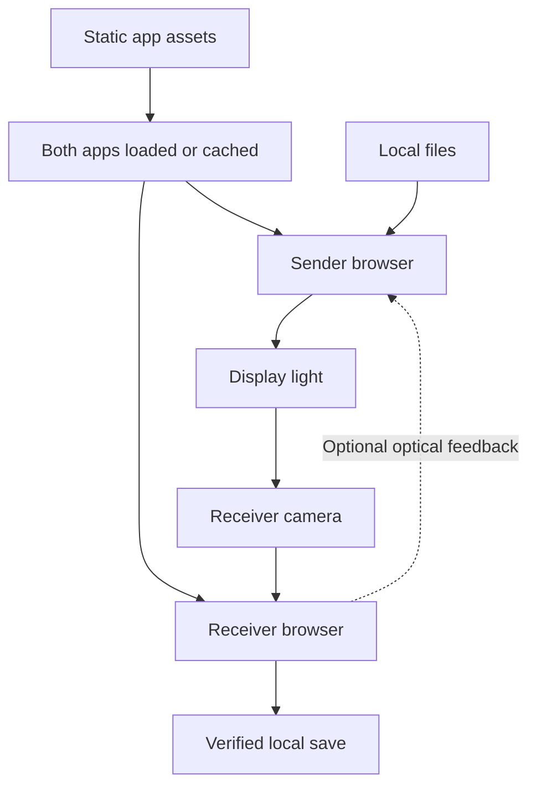
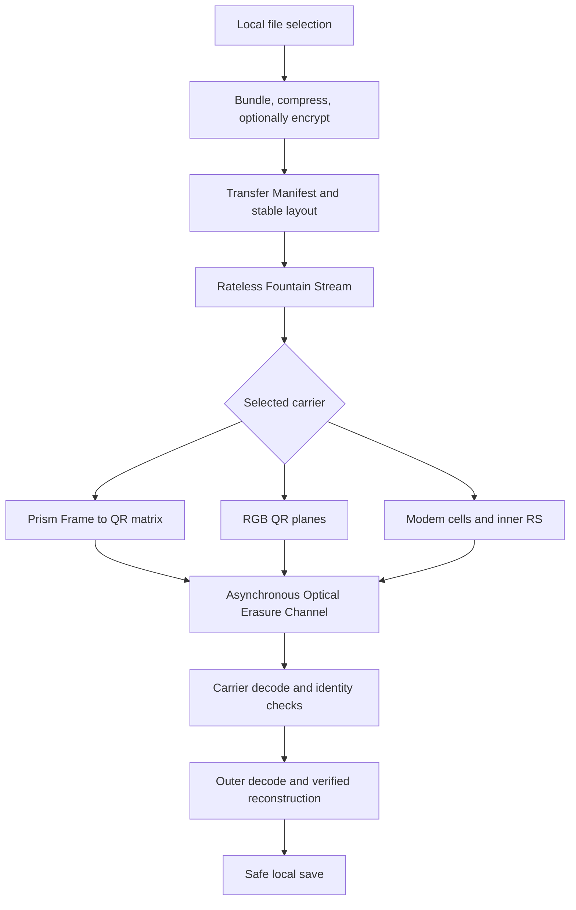
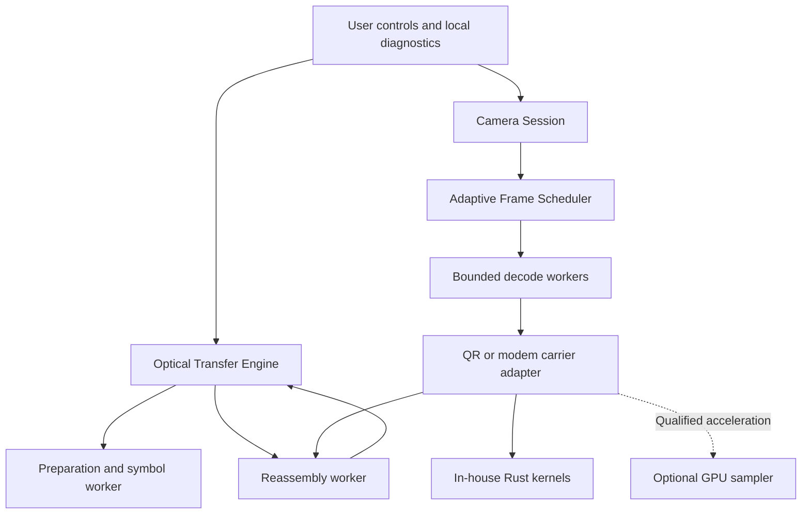

# Optical Transfer architecture

The boundaries of Air-Gapped Optical Transfer, the common engine that every optical carrier shares, who owns what, and what ships today. Status and evidence labels are defined in the [index](README.md).

[Index](README.md) · [Protocol](PROTOCOL.md) · [Receiver](RECEIVER.md) · [Profiles](PROFILES.md)

## D01: Privacy and execution boundary

**Status: PROPOSED system contract, built on the existing client-side invariants in [AGENTS.md](../../AGENTS.md) and [ADR 0022](../adr/0022-no-dynamic-qr-codes-client-side-only.md).**

**Invariant:** the user's payload travels only as displayed light and in local browser memory. The dashed edge is itself a screen-to-camera path, not a network connection. There is no payload URL, server, WebRTC connection, radio or audio data channel.

Getting the app and moving the payload are separate. A URL beacon can open the receiving page, but a cold browser may need to fetch the app's assets to show it. A fully disconnected demonstration must load or cache every page, worker and WebAssembly module first; never promise that a cold URL launch works without a network. Any offline asset caching must keep the Storage Allowlist and the [Volatile Memory Guarantee](../../CONTEXT.md): payloads and transfer keys are never persistent cache entries.

## D02: One engine, interchangeable optical carriers

**Status: PROPOSED unification. The QR and modem carriers already exist, at different rollout stages (see the [inventory](#implementation-inventory)).**

**Invariant:** switching the optical profile never silently changes the file, the Transfer Manifest's identity, the outer code, the outer symbol size or the Droplet Symbol numbering. If one of those has to change, that is an explicit new session or a separately specified protocol transition.

The existing multi-rate profiles already follow this rule: Steady, Balanced and Fast share one symbol size (`SWITCHABLE_SYMBOL_SIZE = 350` in [controller.ts](../../src/packages/optical-transfer/lib/feedback/controller.ts)) so that a switch keeps the same Session ID and decoder.

BC-UR ([ADR 0041](../adr/0041-wallet-compatible-bc-ur-sending.md)) stays a separate compatibility transport with its own semantics. It is not implicitly compatible with Prism or the proposed modem envelope, and it is not a maximum-throughput path.

## D03: Responsibilities and ownership

**Status: PROPOSED ownership model, mapped onto the existing deep modules below.**

**Invariant:** the UI never owns a second camera stream or a second reassembly implementation. GPU availability changes how a frame is processed, never what is on the wire. A capability fallback keeps the CPU path usable and does not keep retrying a path it already knows fails.

Where each box lives today:

| Box                                  | Module                                                                                                                                                                                  |
| ------------------------------------ | --------------------------------------------------------------------------------------------------------------------------------------------------------------------------------------- |
| Optical Transfer Engine              | [`src/packages/optical-transfer`](../../src/packages/optical-transfer/index.ts) (Prism frames, fountain and outer codes, sender and receiver hooks, multi-code, feedback, colour layer) |
| Camera Session                       | [`src/packages/optical-scanner/lib/cameraSession.ts`](../../src/packages/optical-scanner/lib/cameraSession.ts); the receive page starts and stops it                                    |
| Bounded decode workers               | [`multicode/pool.ts`](../../src/packages/optical-transfer/lib/multicode/pool.ts) and [`receiver/tileReader.ts`](../../src/packages/optical-transfer/lib/receiver/tileReader.ts)         |
| Modem carrier, probe and GPU sampler | [`src/packages/optical-modem`](../../src/packages/optical-modem/flag.ts), behind the `VITE_OPTICAL_MODEM` build flag                                                                    |
| Rust kernels                         | `crates/prism-fec`, `crates/qr-decode`, `crates/qr-encode`, `crates/modem`, `crates/core` (see [RUST.md](../RUST.md))                                                                   |

Use browser built-ins for compression (`CompressionStream`) and cryptography (WebCrypto). Rust kernels use no third-party crates; TypeScript owns the UI and orchestration ([ADR 0033](../adr/0033-rust-webassembly-modules.md), [ADR 0040](../adr/0040-in-house-first.md)). App code imports packages through their root entry points. Keep the existing first-load and per-module WebAssembly budgets; nothing here asks for a dependency or a higher limit.

## Implementation inventory

**Status: CURRENT at the reviewed commit.** What a default user gets, what is behind a switch and what is not on the site at all.

| Piece                                                      | Rollout state                                                                                                                                                                                                                  | Evidence in the source                                                                                                                                                                                                             |
| ---------------------------------------------------------- | ------------------------------------------------------------------------------------------------------------------------------------------------------------------------------------------------------------------------------ | ---------------------------------------------------------------------------------------------------------------------------------------------------------------------------------------------------------------------------------- |
| Prism frame format and LT outer code                       | Default                                                                                                                                                                                                                        | [ADR 0024](../adr/0024-prism-frame-format.md); [`prism/frame.ts`](../../src/packages/optical-transfer/lib/prism/frame.ts)                                                                                                          |
| Fixed transfer look, one QR version per stream             | Default. Every frame and the key QR are square black modules on white; the sender page has no appearance controls. A single-code stream draws manifest and data frames at one version, so the code never changes size          | [`handshake.ts`](../../src/packages/optical-transfer/lib/handshake.ts) (`drawTransferFrame`); [`sender/streamSymbols.ts`](../../src/packages/optical-transfer/lib/sender/streamSymbols.ts)                                         |
| LT over LDPC precode outer code                            | Opt-in preview: "New transfer format (preview)" on the sender. Up to 4 blocks (`MAX_FEC_BLOCKS`); larger transfers fall back to LT                                                                                             | [ADR 0037](../adr/0037-prism-outer-code-lt-over-ldpc-precode.md), [ADR 0038](../adr/0038-prism-manifest-v2-outer-code-opt-in.md); [`prism/manifest.ts`](../../src/packages/optical-transfer/lib/prism/manifest.ts)                 |
| Multi-code frames and multi-rate beacons                   | Preview switches: "Several codes per frame (preview)" on the sender, "Read several codes per frame (preview)" on the receiver                                                                                                  | [ADR 0039](../adr/0039-multi-code-frames-behind-preview-switches.md), [ADR 0031](../adr/0031-multi-rate-stream-and-speed-profiles.md)                                                                                              |
| Webcam back channel                                        | Preview switches: "Let the receiver steer (preview)" on the sender, "Help the sender pick its speed (preview)" on the receiver                                                                                                 | [ADR 0032](../adr/0032-webcam-back-channel.md); [`feedback/controller.ts`](../../src/packages/optical-transfer/lib/feedback/controller.ts)                                                                                         |
| RGB colour layer (#1147)                                   | Parked. The code is in the package but nothing in the app imports it, and `createColourSender` returns `null` unless a caller passes `enabled: true`                                                                           | [`index.ts`](../../src/packages/optical-transfer/index.ts); [`colour/profile.ts`](../../src/packages/optical-transfer/lib/colour/profile.ts). Its stored timing predates the in-house decoder and never used the tracked read path |
| Optical modem: probe, reference codec, GPU sampler, ladder | Research behind the `VITE_OPTICAL_MODEM` build flag; not on the site. ADR 0028 is still `proposed`. Integrity gap and no device qualification (see [D05](PROTOCOL.md#d05-turn-corruption-into-erasures-before-outer-decoding)) | ADRs [0027](../adr/0027-optical-channel-probe.md) to [0030](../adr/0030-optical-profile-ladder.md); [`optical-modem/flag.ts`](../../src/packages/optical-modem/flag.ts)                                                            |
| Wallet-compatible BC-UR                                    | Sender switch "Wallet-compatible (BC-UR)"; the receiver reads real BC-UR streams                                                                                                                                               | [ADR 0041](../adr/0041-wallet-compatible-bc-ur-sending.md)                                                                                                                                                                         |

## Existing authority

These remain authoritative for their own responsibilities, and these pages link to them rather than copying them:

- [AGENTS.md](../../AGENTS.md) and [CONTEXT.md](../../CONTEXT.md).
- [Documentation maintenance](../agents/docs-maintenance.md).
- [ADR 0014](../adr/0014-rateless-fountain-codes-for-airgapped-optical-transfer.md) (fountain codes), [ADR 0017](../adr/0017-consolidated-air-gapped-optical-transfer-package.md) (one transfer package), [ADR 0024](../adr/0024-prism-frame-format.md) (Prism frames), [ADR 0025](../adr/0025-private-transfers-and-bundles.md) (private transfers and bundles), [ADR 0036](../adr/0036-in-house-qr-decoder-replaces-zxing-wasm.md) (in-house QR decoder), [ADR 0037](../adr/0037-prism-outer-code-lt-over-ldpc-precode.md) and [ADR 0038](../adr/0038-prism-manifest-v2-outer-code-opt-in.md) (outer code), [ADR 0039](../adr/0039-multi-code-frames-behind-preview-switches.md) (multi-code), [ADR 0040](../adr/0040-in-house-first.md) (in-house first).
- The modem ADRs [0027](../adr/0027-optical-channel-probe.md), [0028](../adr/0028-optical-modem-frame-format.md), [0029](../adr/0029-optical-gpu-decode-kernel.md) and [0030](../adr/0030-optical-profile-ladder.md); ladder and feedback ADRs [0031](../adr/0031-multi-rate-stream-and-speed-profiles.md) and [0032](../adr/0032-webcam-back-channel.md).
- [TRANSFER_BENCHMARK.md](../TRANSFER_BENCHMARK.md) and the [device checklist](../TRANSFER_DEVICE_CHECKLIST.md).
