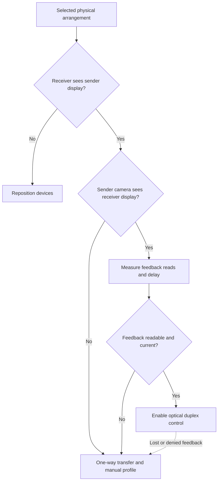
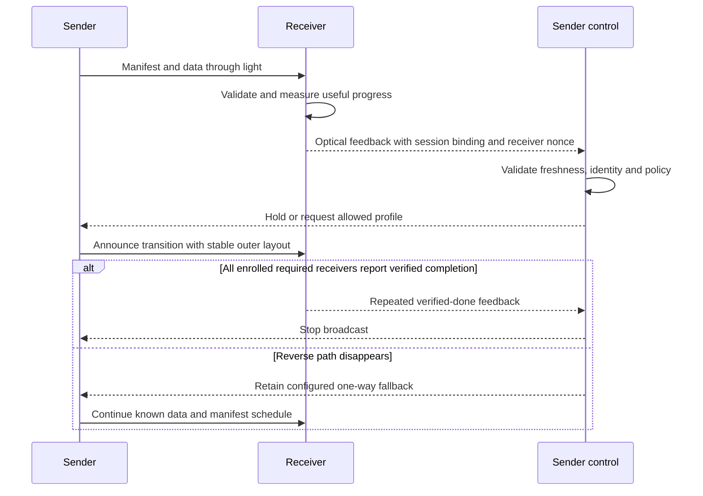

# Optical Transfer feedback

**Status: PROPOSED physical qualification and control policy around the existing preview back channel ([ADR 0032](../adr/0032-webcam-back-channel.md)).**

[Index](README.md) · [Profiles](PROFILES.md) · [Validation](VALIDATION.md)

## What the back channel does today

**Status: CURRENT, behind the preview switches "Let the receiver steer (preview)" on the sender and "Help the sender pick its speed (preview)" on the receiver.**

- The receiver shows a small feedback QR, a Prism frame of type 2 that names the session and carries a 4-byte random nonce, the fraction decoded, the frame success rate, the densest layer read and a done flag ([`prism/frame.ts`](../../src/packages/optical-transfer/lib/prism/frame.ts)). The sender's webcam reads it ([`feedback/link.ts`](../../src/packages/optical-transfer/lib/feedback/link.ts)).
- The controller ([`feedback/controller.ts`](../../src/packages/optical-transfer/lib/feedback/controller.ts)) ignores reports for another session, tracks at most 16 receivers (`MAX_RECEIVERS`) by nonce only, forgets a receiver after 5 s of silence (`RECEIVER_EXPIRY_MS`), follows the weakest unfinished receiver, ignores reports for 1.5 s after a change, climbs one profile after 2 s of good reads, doubles the wait after a failed climb up to 16 s, and stops when every receiver reports done.
- In simulation it stopped within 1 s of done in every run; a strong receiver finished in 7.1 s against 5.3 s for a sender that knew to use Fast ([FEEDBACK_BENCHMARK.md](../FEEDBACK_BENCHMARK.md), Measured-sim).
- **Geometry (Measured-code).** The sender opens its webcam with `facingMode: 'user'` ([`src/pages/file-transfer/+Page.tsx`](../../src/pages/file-transfer/+Page.tsx)); the receiver's Camera Session prefers the rear camera ([`cameraSession.ts`](../../src/packages/optical-scanner/lib/cameraSession.ts)). So when a laptop sends to a phone, the phone's screen, which shows the feedback code, faces away from the laptop's webcam.

## D14: Geometry comes before controller tuning

**Status: PROPOSED.**

**Invariant:** camera permission and a controller cannot create line of sight. An arrangement whose geometry rules out the reverse path is still a valid one-way arrangement. Feedback is an optimisation for compatible arrangements, not a prerequisite for speed.

| Arrangement                                                                       | Physical expectation                          | Qualification                                                     |
| --------------------------------------------------------------------------------- | --------------------------------------------- | ----------------------------------------------------------------- |
| Laptop sends; phone receives with its rear camera                                 | The phone's screen faces away from the webcam | No natural direct reverse path                                    |
| Phone sends; laptop receives with its webcam; the phone's front camera reads back | Screens and cameras can face each other       | Plausible; test the actual placement and both capture paths       |
| Two devices with front cameras and screens facing each other                      | Both directions can be visible                | Plausible; the forward camera's quality may change                |
| External camera, mirror or special rig                                            | Depends on the arrangement                    | Document the exact geometry; do not generalise it to handheld use |
| Several receivers                                                                 | Some may have feedback and some may not       | Define the mixed-receiver policy explicitly                       |

No arrangement is declared working from its geometry alone. Test distance, focus, orientation, glare, the feedback code's size, and the load of rendering and capturing at the same time.

## D15: Duplex operation and controlled fallback

**Status: PROPOSED precise control contract. The current preview messages and policy need reconciling with it.**

**Invariant:** missing feedback never means a receiver finished. A done report follows final verification, not full rank. Lost feedback cannot switch the stream to an unsupported format or start unbounded probing.

Bind feedback to the admitted transfer and check its nonce, range, freshness and allowed profile; today's frames already carry the Session ID and the frame CRC. A nonce identifies a receiver for control; it does not authenticate it, and a checksummed report is not a trusted, authenticated message. Expiry and a maximum count exist today (5 s, 16 receivers); the policy below decides what they mean for completion.

## Broadcast and completion policy

| Policy                          | Speed choice                                                            | Completion consequence                                                           |
| ------------------------------- | ----------------------------------------------------------------------- | -------------------------------------------------------------------------------- |
| Single receiver                 | Best qualified point for that receiver                                  | Stop after a repeated verified-done report, or by hand in one-way use            |
| All required enrolled receivers | Lowest common qualified point, or a specified layered schedule          | Stop only when the required enrolled set is verified done                        |
| Fast-priority broadcast         | The profile favours chosen receivers, with baseline service if promised | Weak receivers may finish later; the UI must explain this                        |
| Anonymous one-way broadcast     | Fixed or manual profile, or a documented interleave                     | The sender cannot know everyone finished; manual stop and a late-entry trade-off |

"Follow the weakest unfinished receiver" (today's controller) is one of these policies, not a protocol requirement. An enrolled set needs an explicit join policy: do not admit an arbitrary late nonce forever, silently drop a required receiver, or promise that anonymous listeners all finished.

## Sources

[Feedback link](../../src/packages/optical-transfer/lib/feedback/link.ts), [feedback controller](../../src/packages/optical-transfer/lib/feedback/controller.ts), [FEEDBACK_BENCHMARK.md](../FEEDBACK_BENCHMARK.md), [ADR 0032](../adr/0032-webcam-back-channel.md) and the [device checklist](../TRANSFER_DEVICE_CHECKLIST.md).
