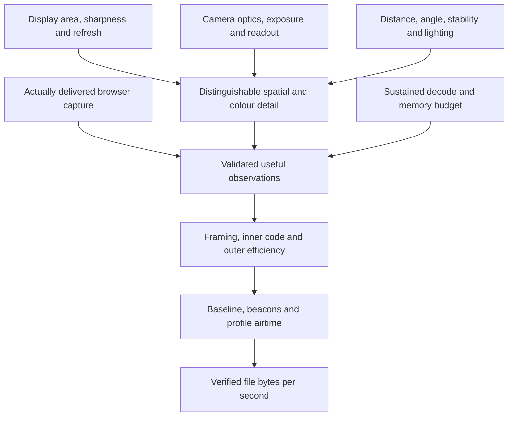

# Optical Transfer performance

**Status: PROPOSED qualification targets and Inferred engineering scenarios.** None of the targets on this page is a device measurement, a guarantee or an established physical maximum. Measured simulator results stay in the existing benchmark documents and are linked, not copied.

[Index](README.md) · [Profiles](PROFILES.md) · [Validation](VALIDATION.md)

## Four different quantities

| Quantity             | Definition                                                                              | Evidence needed                                                                    |
| -------------------- | --------------------------------------------------------------------------------------- | ---------------------------------------------------------------------------------- |
| Compatibility        | A receiver can interpret and complete the baseline transport                            | Protocol conformance and a readable optical link                                   |
| Qualification target | Intended sustained goodput on a defined reference arrangement                           | Repeated physical runs, plus resource and safety qualification                     |
| Conditional envelope | The rate calculated for a chosen resolution, cell pitch, constellation and efficiencies | Explicit assumptions; it stays Inferred                                            |
| Channel capacity     | The information the physical observations support under a defined model                 | A calibrated channel model with stated noise, correlation and decoding assumptions |

Do not call a raw grid rate a theoretical maximum: another modulation, optical arrangement or browser path changes the envelope. Mutual information from one particular hard classifier is not the capacity of every camera observation.

## D16: The pairing, not the brand, sets the envelope

**Status: PROPOSED.**

**Invariant:** a high marketing camera resolution does not imply high information throughput in the browser. Better hardware helps only where the browser exposes it and the optical and compute chain sustains it.

The unit of analysis is the whole pairing: sender display, receiving camera and lens, browser capture path, positioning and lighting, and sustained processing. An expensive phone is not automatically the best receiver; a cheaper camera in a stable, well-focused arrangement can beat it. For each pairing, record four layers separately:

1. **Hardware:** what the camera and display can physically provide.
2. **Browser:** which modes the page can reach. The configured frame rate can differ from the delivered one, and a capability range does not prove that its highest resolution and highest frame rate work together (W3C [Media Capture and Streams](https://www.w3.org/TR/mediacapture-streams/)).
3. **Optical:** how much distinct information survives focus, motion, exposure and colour processing.
4. **Implementation:** how much validated information the software processes continuously.

## Proposed reference classes

**Status: PROPOSED targets for qualification.** They are not wire profile IDs and not promises to every device with a given resolution. Decimal units: 1 KB = 1,000 bytes, 1 MB = 1,000,000 bytes.

| Class                  | Qualification arrangement                                                                  | Target sustained verified goodput |
| ---------------------- | ------------------------------------------------------------------------------------------ | --------------------------------- |
| Minimum qualified link | A defined low-quality or older camera reading coarse monochrome symbols, in a stable setup | At least 1 KB/s                   |
| Compatibility          | A weak or low-resolution camera in a documented, reasonable setup                          | 5–20 KB/s                         |
| Everyday               | An ordinary camera and display, with no special positioning equipment                      | 50–150 KB/s                       |
| Enhanced               | Good optical detail and colour separation, with enough processing                          | 200–500 KB/s                      |
| High performance       | A favourable, stable pairing with useful high-resolution or high-rate capture              | 1–2 MB/s                          |
| Experimental stretch   | Browser-accessible 4K60 or a comparable information budget, with enough optical detail     | 3–5 MB/s                          |

There is no architectural cap at 1 MB/s. "Any webcam reaches 1 KB/s" cannot be defended, because a camera that cannot focus on the display may recover almost nothing; the minimum needs a defined arrangement. Below a target, reception stays useful best effort. Missing a target is a measurement result, never a reason to hide a configuration or relabel it as passed.

## Achievable goodput model

For one uniform carrier:

`G = N_data_cells × log2(M) × R_inner × F_useful × η_outer × η_schedule ÷ 8` (bytes per second)

| Term           | Units and meaning                                                                                                                                                                     |
| -------------- | ------------------------------------------------------------------------------------------------------------------------------------------------------------------------------------- |
| `N_data_cells` | Data cells in one complete carrier frame, framing already excluded                                                                                                                    |
| `log2(M)`      | Raw bits per cell for a constellation of `M` symbols                                                                                                                                  |
| `R_inner`      | Inner-code payload over codeword length, including any checksum or identity bytes counted at this layer                                                                               |
| `F_useful`     | Equivalent useful frames per second: validated new payload per second divided by the payload of one complete frame, so a partial capture counts fractionally and a repeat counts zero |
| `η_outer`      | Useful output over admitted outer-symbol payload, including rank overhead and symbols wasted on solved blocks                                                                         |
| `η_schedule`   | The airtime share of the modelled carrier, if `F_useful` does not already include it                                                                                                  |

Never count the same loss twice by multiplying a measured value that already contains it by another factor. Count identity bytes exactly once, at frame or inner-block level. For several carriers or regions, add their separate useful contributions and account for shared resources. Verified file goodput, measured directly, stays the authoritative product metric.

Mutual information per cell (the probe of [ADR 0027](../adr/0027-optical-channel-probe.md) reports it) says whether a constellation and code rate are plausible. Do not substitute it for `log2(M)` and multiply by an arbitrary ECC rate to claim an achievable goodput.

## Conditional envelopes

**Status: Inferred.** Let `W` × `H` be the captured image, the screen fill 80% of each dimension (64% of the area), and `p` be captured camera pixels per cell:

- `N_geometric_cells = 0.64 × W × H ÷ p²` (unlike `N_data_cells`, this includes overhead regions)
- `raw_grid_rate = N_geometric_cells × bits_per_cell × fps ÷ 8`
- `budget_goodput = raw_grid_rate × 0.60 × 0.80`, where 0.60 is combined framing and coding efficiency and 0.80 is useful capture yield. Processing is assumed to keep up.

| Capture             | Camera px per cell | Encoding          | Raw grid rate | Budget goodput |
| ------------------- | ------------------ | ----------------- | ------------- | -------------- |
| 640×480 at 15 fps   | 8                  | Mono, 1 bit       | 5.76 KB/s     | 2.76 KB/s      |
| 1280×720 at 30 fps  | 6                  | Mono, 1 bit       | 61.44 KB/s    | 29.49 KB/s     |
| 1920×1080 at 30 fps | 4                  | 8 colours, 3 bits | 933.12 KB/s   | 447.90 KB/s    |
| 1920×1080 at 60 fps | 4                  | 8 colours, 3 bits | 1.87 MB/s     | 895.80 KB/s    |
| 3840×2160 at 30 fps | 4                  | 8 colours, 3 bits | 3.73 MB/s     | 1.79 MB/s      |
| 3840×2160 at 60 fps | 4                  | 8 colours, 3 bits | 7.46 MB/s     | 3.58 MB/s      |
| 3840×2160 at 60 fps | 3                  | 8 colours, 3 bits | 13.27 MB/s    | 6.37 MB/s      |

These are calculations, not measured rates or physical maxima; the 3 px colour row may fail optically even where the browser delivers 4K60. They support 1–2 MB/s as a high-performance research target and 3–5 MB/s as a stretch target. Three bounds the table does not show (reasoned, not measured):

- **The sender's display.** At 2 device pixels per cell a 1080p display holds at most 960 × 540 cells, so the 4K rows need a 4K-class or large high-density sender.
- **The capture path.** USB webcams often deliver 1080p60 and 4K as MJPEG or H.264, so frames may be codec-compressed before the page sees them. Unverified per device.
- **Moving the pixels.** 4K60 is about 500 million pixels a second, about 2 GB/s as RGBA, before any decoding. Copy, upload and readback costs belong in the implementation layer.

A 4K camera must deliver more optical detail, not just a bigger processed image. Bayer sampling, ISP processing, display subpixels, focus and moiré all limit distinguishable information. Do not treat a fixed two-times chroma penalty or one pixels-per-cell rule as a physical law.

## Metrics with explicit clocks

| Metric                    | Clock and numerator                                                                      | Avoid                                                       |
| ------------------------- | ---------------------------------------------------------------------------------------- | ----------------------------------------------------------- |
| Acquisition time          | Receiver starts capture to admitted, readable manifest                                   | Hiding setup inside a steady-state number                   |
| Receiver completion time  | Capture start to verified completion                                                     | Calling full rank completion                                |
| Sender-to-completion time | First transmitted frame to the receiver's verified completion                            | Comparing it with capture-start time without saying so      |
| Sustained link goodput    | Unique useful payload over a stated steady interval, at a named stage boundary           | Counting repeated frames, symbols or completed blocks again |
| Verified file goodput     | Original file bytes divided by the named completion interval                             | Inflating speed with highly compressible fixtures           |
| Encoded-byte rate         | Compressed or encrypted transfer bytes over a stated interval                            | Calling it original-file goodput                            |
| Decode cost               | Elapsed time per stage and for the pipeline, on CPU and GPU, with host and browser named | Treating simulated time as sustained elapsed throughput     |
| Thermal stability         | Rate, queues and resources across the whole sustained run                                | Quoting a brief peak as a sustained figure                  |

The headline metric is verified goodput on uncompressed random files, with acquisition time reported separately. Realistic, compressible files are a separate product test. Record small-file start-up and large-file steady state separately. Diagnostics stay in memory or in a report the person explicitly exports; nothing is uploaded ([PLEDGE.md](../PLEDGE.md)).

## Limits of the existing evidence

**Status: CURRENT, Measured-code and Measured-sim.**

- The colour layer's 220.6 KB/s ([TRANSFER_BENCHMARK.md](../TRANSFER_BENCHMARK.md)) runs on a simulated camera clock and assumes decoding keeps up. The stored numbers predate the in-house decoder, and the bench fixture decodes each plane with a full `qrReader.read`, not the tracked `readTracked` fast path ([`tests/utils/colourBench.ts`](../../tests/utils/colourBench.ts)), so it says nothing about tracked-path speed.
- The modem ladder bench ([`scripts/bench_optical_ladder.ts`](../../scripts/bench_optical_ladder.ts)) uses the old LT `FountainEncoder` with 16-byte droplets, not the new outer code with the larger symbols a high-throughput modem would use. Outer symbol size, inner block size and profile geometry need choosing separately and benchmarking together.
- The new outer code's p99 figures at K = 8,192 rest on 30 trials ([ADR 0037](../adr/0037-prism-outer-code-lt-over-ldpc-precode.md)); report sample size and uncertainty with any tail figure.
- The modem's GPU path reads back synchronously, so shader time alone is not a full-path timing.
- No figure here establishes a comparable maximum.

## Sources

[TRANSFER_BENCHMARK.md](../TRANSFER_BENCHMARK.md), [OPTICAL_BENCHMARK.md](../OPTICAL_BENCHMARK.md), [OPTICAL_LADDER_BENCHMARK.md](../OPTICAL_LADDER_BENCHMARK.md), [colour bench fixture](../../tests/utils/colourBench.ts), [ladder bench script](../../scripts/bench_optical_ladder.ts) and the W3C [Media Capture and Streams](https://www.w3.org/TR/mediacapture-streams/) specification.
