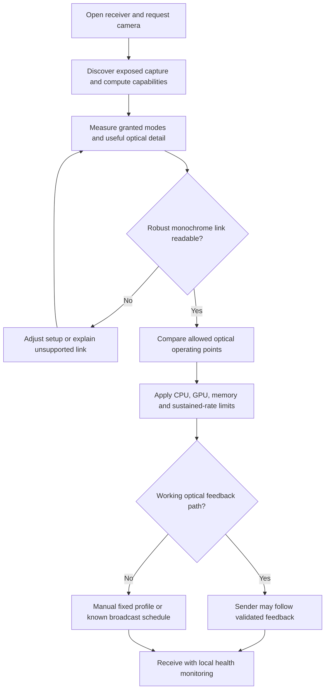
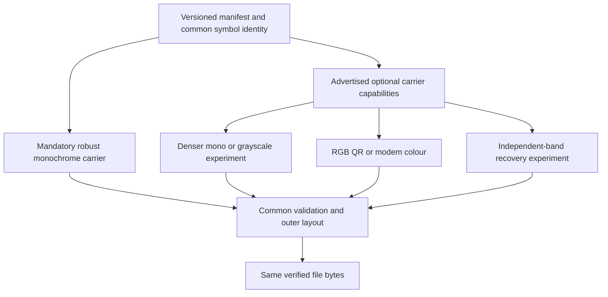
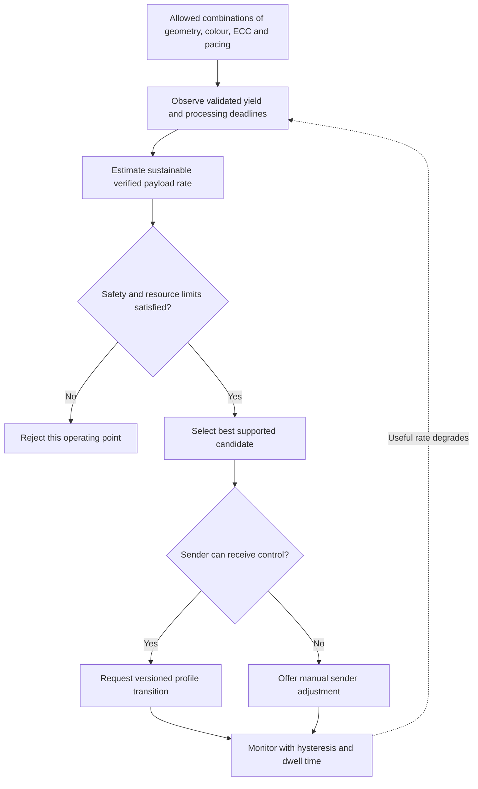

# Optical Transfer profiles

**Status: PROPOSED device-agnostic capability and interoperability model.** The performance classes in [Performance](PERFORMANCE.md#proposed-reference-classes) are product qualification classes, not new wire profile numbers. The existing names keep their meanings until an ADR changes them.

[Index](README.md) · [Feedback](FEEDBACK.md) · [Performance](PERFORMANCE.md)

## Profile names that exist today

**Status: CURRENT.** Two separate sets of names exist, and two names appear in both:

| Set                          | Names                                                                                                       | Where                                                                                                                                                       |
| ---------------------------- | ----------------------------------------------------------------------------------------------------------- | ----------------------------------------------------------------------------------------------------------------------------------------------------------- |
| QR multi-rate profiles       | Steady (1×v30), Balanced (2×2 v20, default), Fast (2×2 v25), with targets of 15–30, 50–150 and 150–300 KB/s | [`multicode/multirate.ts`](../../src/packages/optical-transfer/lib/multicode/multirate.ts), [ADR 0031](../adr/0031-multi-rate-stream-and-speed-profiles.md) |
| Modem ladder rungs           | P0 and P1 are QR rungs (beacons, dense multi-QR); P2 Steady (4 colours), P3 Fast (8), P4 Rapid (16)         | [`optical-modem/lib/profile.ts`](../../src/packages/optical-modem/lib/profile.ts), [ADR 0030](../adr/0030-optical-profile-ladder.md)                        |
| Single-code Transfer Density | Reliable, Balanced, Fast                                                                                    | [CONTEXT.md](../../CONTEXT.md)                                                                                                                              |

The multi-rate targets are targets, not measurements. Because "Steady" and "Fast" mean different things in the QR and modem sets, documents and UI copy should always say which set they mean.

## D11: Choose by observed capability, not by brand

**Status: PROPOSED.**

**Invariant:** operating system, vendor, model name and the marketing camera specification never assign a performance class. Measured, browser-accessible configurations decide qualification. Capability detection runs locally and is never uploaded.

A receiver can change its own camera constraints and compute path without feedback. It cannot change what a one-way sender displays. Initial acquisition uses a robust, known profile before any optional probe; starting a transfer must never depend on an automatic handshake that does not exist. The controller described here is proposed, not an existing automatic cross-device optimiser. With several receivers, profile selection follows an explicit policy (see [Feedback](FEEDBACK.md#broadcast-and-completion-policy)).

## D12: Baseline interoperability and optional extensions

**Status: PROPOSED common envelope. The exact bridge from the modem header to the Prism identity is still a protocol decision (see [Protocol](PROTOCOL.md#identity-and-versioning-decisions-to-reconcile)).**

**Invariant:** an optional extension can never remove the mandatory compatibility path or silently change the outer layout. A weak webcam and an excellent camera rebuild the same file through the same session and integrity rules.

A receiver that only reads the baseline must be able to finish from the baseline schedule alone, not merely read an occasional URL or manifest beacon. Sparse beacons let a receiver finish only if they carry enough compatible data over time; the multi-rate beacons are designed for this, since they carry symbols from the same fountain stream, so a weak or distant camera still finishes from the beacons alone ([ADR 0031](../adr/0031-multi-rate-stream-and-speed-profiles.md); shown in simulation only). Define the longest manifest reacquisition time and the least baseline data airtime for every broadcast schedule.

Never describe a large-version QR beacon as universally robust: choose its module count and captured size for the minimum qualified link. Higher-rate layers are multiplexed in time or space and spend a measured share of the budget. Simultaneous hierarchical luma and chroma layers are an experiment, not free extra capacity.

## D13: Choosing an operating point

**Status: PROPOSED.**

**Invariant:** the goal is the highest sustained useful payload rate within the limits, not the largest constellation, the highest resolution or the most workers. Use bounded probes, hysteresis and a cooldown so the link is not destabilised over and over.

Profile selection is not one ladder. One receiver may read a dense monochrome grid well and struggle with colour; another may do best with coarse colour cells. Selection compares measured goodput across the alternatives. In one-way use, measuring several candidates needs a known probe schedule or coordinated manual changes.

## Mandatory and optional behaviour

| Mandatory for every implementation             | Optional performance extension                                      |
| ---------------------------------------------- | ------------------------------------------------------------------- |
| Robust monochrome acquisition and data profile | Colour, multilevel grayscale or spatial-symbol experiments          |
| Explicit handling of unsupported versions      | Additional compatible profiles                                      |
| Common file, session and integrity rules       | Band recovery or an alternative inner code with explicit versioning |
| A CPU decode path and bounded memory           | Device-qualified GPU acceleration                                   |
| Completion without duplex                      | Automatic duplex control and auto-stop                              |
| Pause, cancel and explicit completion          | Higher-rate rendering after safety qualification                    |
| Joining late through the repeated manifest     | Faster acquisition and richer local diagnostics                     |

The baseline is device-agnostic, but it still needs a camera that can resolve the display and a browser that supplies the needed APIs. Below the minimum qualified link, receiving is best effort: the app explains slow progress and suggests adjustments (move closer, hold steadier, raise brightness, choose a more robust profile).

## Sources

[QR multi-rate profiles](../../src/packages/optical-transfer/lib/multicode/multirate.ts), [modem profiles](../../src/packages/optical-modem/lib/profile.ts), [ADR 0030](../adr/0030-optical-profile-ladder.md), [ADR 0031](../adr/0031-multi-rate-stream-and-speed-profiles.md), the W3C [Media Capture and Streams](https://www.w3.org/TR/mediacapture-streams/) and [MediaStream Image Capture](https://www.w3.org/TR/image-capture/) specifications.
