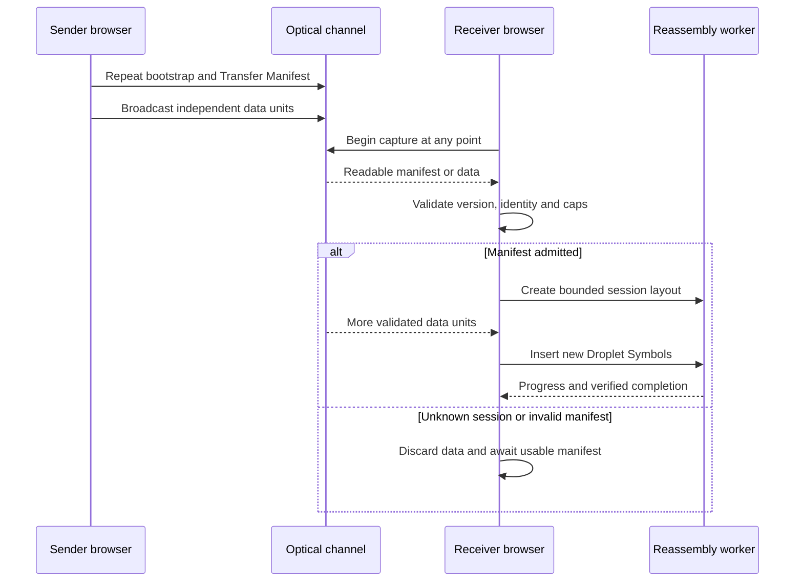
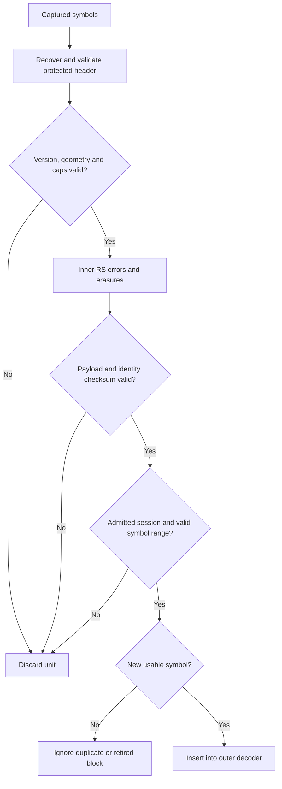
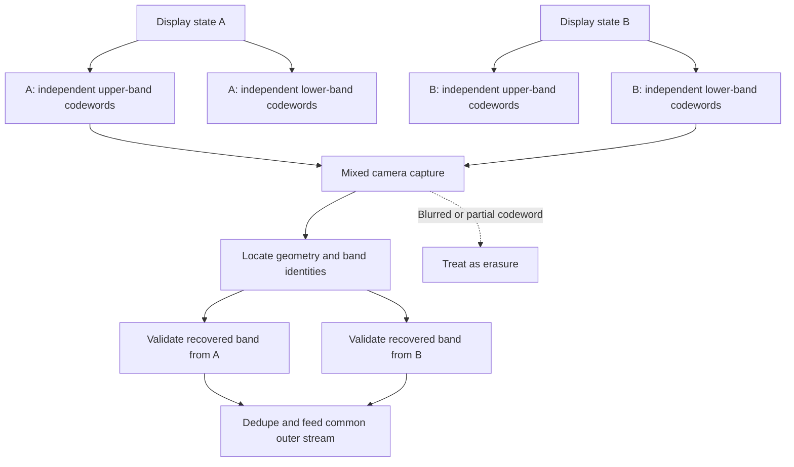
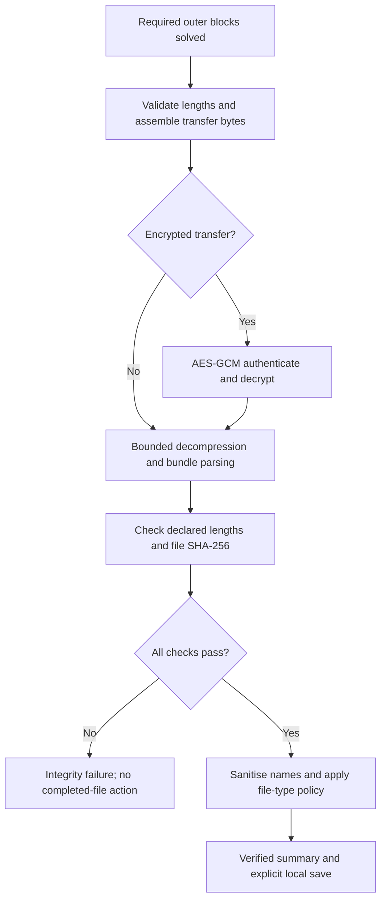

# Optical Transfer protocol

**Status: PROPOSED carrier-independent contract and recovery design.** Today the Prism frame format, the modem header and BC-UR each have their own identity and framing rules. This page does not claim they are already unified, and it does not invent final field encodings: those belong in reviewed ADRs.

[Index](README.md) · [Architecture](ARCHITECTURE.md) · [Receiver](RECEIVER.md) · [Profiles](PROFILES.md)

## D04: Stateless Stream Entry and session admission

**Status: PROPOSED full lifecycle. The CURRENT foundations are the repeated Transfer Manifest (one frame in `MANIFEST_INTERVAL = 16`, [`prism/session.ts`](../../src/packages/optical-transfer/lib/prism/session.ts)) and the receive caps in [`limits.ts`](../../src/packages/optical-transfer/lib/limits.ts).**

**Invariant:** no untrusted manifest, header or frame can make the receiver allocate without a bound. Data seen before admission is dropped or held in a strictly bounded quarantine. Because the manifest repeats, a receiver can start late, and nothing depends on reading the first frame. Admission can ask for the person's consent for a new file or a risky type, as the existing [abuse protections](../ABUSE_PROTECTIONS.md) already do.

Private mode needs its key, which is communicated separately ([ADR 0025](../adr/0025-private-transfers-and-bundles.md)). A bootstrap URL carries no file bytes and no private key. In non-private mode the SHA-256 shows the output matches the admitted manifest; it does not authenticate the sender.

## D05: Turn corruption into erasures before outer decoding

**Status: PROPOSED fix for the modem and a shared admission boundary. The QR path already has one: every Prism Frame carries a CRC-32C ([ADR 0024](../adr/0024-prism-frame-format.md)).**

**Invariant:** a Reed-Solomon success is not proof that the payload is right. Check it independently before it enters elimination. Rejected data becomes an erasure, never a corrupt equation. The final whole-transfer check is still mandatory.

**The gap today (CURRENT, Measured-code).** [ADR 0028](../adr/0028-optical-modem-frame-format.md) says "a block that decodes is exact", but the reference decoder does not guarantee it. `decode` in [`crates/modem/src/codec.rs`](../../crates/modem/src/codec.rs) tries erasure limits `[parity, parity >> 1, 0]` and accepts a block on Reed-Solomon success alone. On the first attempt it can mark as many bytes as there are check bytes as erasures; with no redundancy left, erasure decoding returns some valid codeword and cannot notice a wrong byte among the bytes it treated as sure. A miscorrected block then enters GF(2) elimination as a droplet, the file fails its final SHA-256, and the receiver cannot tell which droplet poisoned it. The simulator bench counts only blocks whose bytes match what was sent ([`scripts/bench_optical.ts`](../../scripts/bench_optical.ts)), so its goodput is honest, but it does not report how many wrong blocks the decoder accepted. The modem is behind a build flag, so no user is affected; this must be fixed before any modem rollout.

The proposed check binds the payload to its session identity, outer block, Droplet Symbol index, fragment offset and length where fragments exist, and band identity where bands exist. Choose the canonical byte encoding and the checksum width in a reviewed ADR. Do not quote a universal undetected-error rate for a CRC without stating its error model. An unkeyed checksum catches accidental corruption, not deliberate forgery; encrypted transfers keep their AES-GCM authentication.

Bound the decoder's work before trusting any dimension: image size, cells, Reed-Solomon parameters, blocks, retries and allocations. A protected header can still be invalid or miscorrected.

## Identity and versioning decisions to reconcile

| Identity            | CURRENT                                                                                                                                                                         | PROPOSED requirement                                                                                           |
| ------------------- | ------------------------------------------------------------------------------------------------------------------------------------------------------------------------------- | -------------------------------------------------------------------------------------------------------------- |
| Prism Session ID    | 6 bytes (`SESSION_ID_BYTES`, [`prism/frame.ts`](../../src/packages/optical-transfer/lib/prism/frame.ts)): the first bytes of the manifest's SHA-256, or an HMAC in private mode | Keep its semantics and the private-mode HMAC                                                                   |
| Modem session field | 32 bits in the research header ([`optical-modem/lib/header.ts`](../../src/packages/optical-modem/lib/header.ts))                                                                | Specify how it binds to a fully admitted Prism manifest; never treat it as equivalent to the 6-byte Session ID |
| Symbol numbering    | Differs between carriers and benches (Prism uses 24-bit symbol IDs; the modem ladder bench numbers 16-byte droplets)                                                            | Stable outer-block and Droplet Symbol identifiers, independent of profile geometry                             |
| Header version      | Carrier-specific versions; the modem header stops on an unknown version (`unsupported-version`)                                                                                 | Reject unsupported required semantics; an incompatible frame needs an explicit version change                  |
| Profile change      | The multi-rate profiles share one symbol size so a switch keeps the session                                                                                                     | A profile may change cell layout, constellation and inner code, never the outer layout silently                |

Joining late, resuming after a short interruption and switching profile are different from resuming after a page reload. Durable payload storage is not proposed: it would break the Volatile Memory Guarantee.

## D06: Independently recoverable bands

**Status: EXPERIMENT. It needs a new modem layout and version decision.**

**Invariant:** a captured region is useful only when a complete, independently decodable unit survives and validates. A stripe ID alone cannot rebuild the missing bytes of a codeword that is spread across the whole frame.

Today's codec interleaves every Reed-Solomon codeword across the whole grid (byte `i` of block `b` sits at stream position `i * blocks + b`, ADR 0028), so half a torn frame holds fragments of many codewords and completes none. A band design keeps codewords and their interleaving inside each band, with robust identity and calibration nearby. Screen bands are not necessarily horizontal in the camera's sensor coordinates once perspective and orientation are involved. A tear can cross a band or leave a blended boundary. Do not assume exactly two display states, straight tears or that every capture is recoverable. Compare several band sizes with the existing whole-grid interleave on real captures. LightSync (MobiCom 2013) is prior art for recovering partial frames.

## D07: Verification and safe completion

**Status: PROPOSED explicit verification boundary, built on the existing integrity checks and [abuse protections](../ABUSE_PROTECTIONS.md).**

**Invariant:** "complete" means verified output, not full decoder rank or a successful Reed-Solomon return. An authentication failure, excess decompression, a malformed bundle or a mismatched hash all end on the failure path. File-name and type checks also run before untrusted metadata is shown or anything is allocated; this last step is not where they are first enforced.

Once a corrupt equation is inside an outer decoder, later correct symbols do not necessarily repair it. Specify a bounded reset and retry policy rather than promising automatic recovery from poisoned elimination. The D05 check exists to stop accidental poisoning in the first place.

## Sources

[ADR 0024](../adr/0024-prism-frame-format.md), [ADR 0025](../adr/0025-private-transfers-and-bundles.md), [ADR 0028](../adr/0028-optical-modem-frame-format.md), [ADR 0038](../adr/0038-prism-manifest-v2-outer-code-opt-in.md), [modem codec](../../crates/modem/src/codec.rs), [modem header](../../src/packages/optical-modem/lib/header.ts), [Prism receiver](../../src/packages/optical-transfer/lib/prism/receiver.ts), [receive limits](../../src/packages/optical-transfer/lib/limits.ts) and [abuse protections](../ABUSE_PROTECTIONS.md).
