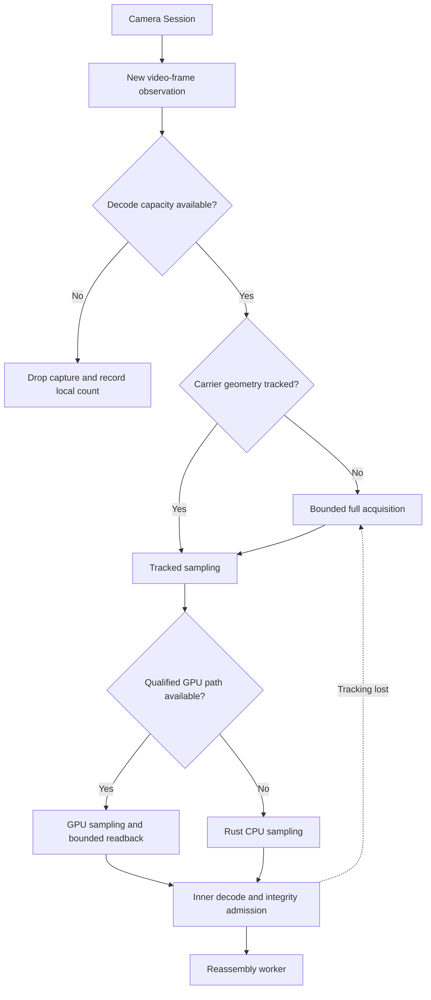
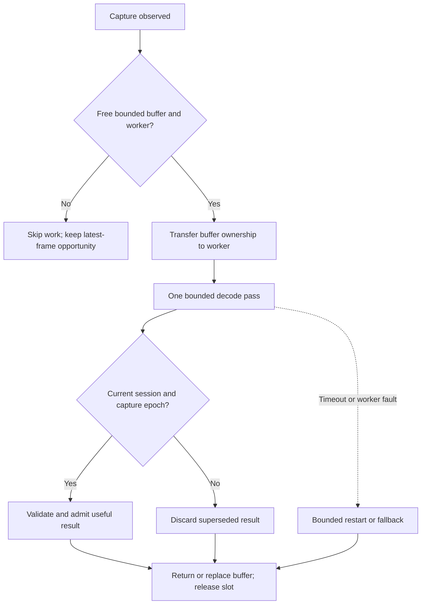
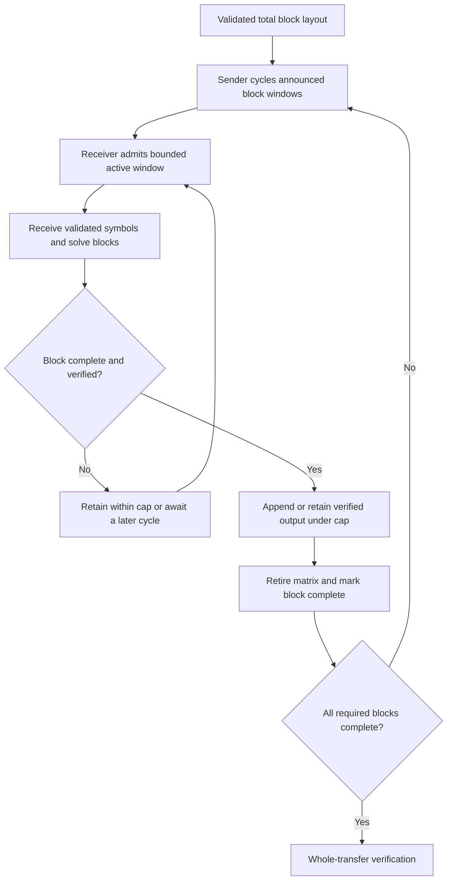

# Optical Transfer receiver

**Status: PROPOSED bounded receiver model.** The Camera Session, the bounded decoder pool and QR tile tracking exist and are its foundations. This page does not claim that modem tracking, band recovery or large-file windows are implemented.

[Index](README.md) · [Protocol](PROTOCOL.md) · [Performance](PERFORMANCE.md)

## What the receiver does today

**Status: CURRENT at the reviewed commit.**

- The receive page owns one [Camera Session](../../src/packages/optical-scanner/lib/cameraSession.ts). It prefers the rear camera (`facingMode: { ideal: 'environment' }`) and asks for 1920×1080 at up to 30 fps, stepping down to 1280×720 and then to no size when the camera refuses. With "Read several codes per frame (preview)" on, it asks for 60 fps instead.
- The multi-code receiver runs a pool of decoder workers sized from `navigator.hardwareConcurrency`: half the cores, at least 2 and at most 4 ([`multicode/pool.ts`](../../src/packages/optical-transfer/lib/multicode/pool.ts)). When every worker is busy the camera frame is skipped, never queued ([`receiver/tileReader.ts`](../../src/packages/optical-transfer/lib/receiver/tileReader.ts)).
- After a full search finds the codes, tracked tiles are read from their last corners by the Rust fast path until tracking is lost ([ADR 0036](../adr/0036-in-house-qr-decoder-replaces-zxing-wasm.md), [ADR 0039](../adr/0039-multi-code-frames-behind-preview-switches.md)).
- The modem's [frame source](../../src/packages/optical-modem/lib/frameSource.ts) uses `requestVideoFrameCallback` and falls back to `requestAnimationFrame`. The modem's [GPU sampler](../../src/packages/optical-modem/lib/gpu.ts) reads results back with a synchronous `gl.readPixels`.

## D08: Capture and decode path

**Status: PROPOSED common path. Tracked QR reads are CURRENT; modem tracking and GPU integration must be verified separately.**

**Invariant:** a slow decoder loses frames within a bound; it never builds a growing queue.

A `requestVideoFrameCallback` call is not a count of sensor exposures. Record its metadata, the actual frame dimensions and the optical sequence or band identifiers. The `requestAnimationFrame` fallback cannot tell a fresh camera frame from a repeat on its own; frame identifiers and content are needed to separate useful captures from repeats.

Profile each stage separately: capture and copy, worker transfer, acquisition, sampling, colour correction, GPU upload and readback, inner code, checksum and outer insertion. Report both the time per stage and the full-pipeline rate under real scheduling. A fast shader alone does not make a fast receiver while readback is synchronous.

## D09: Backpressure and buffer ownership

**Status: PROPOSED scheduling contract, built on the existing bounded-worker pattern. Invariant:** every success, failure, stale result, stop and timeout releases the slot it owns exactly once. A transferred buffer is never still readable by its previous owner.

Choose the worker count from observed performance and memory, not the core count alone (today's pool uses the core count). More workers can compete for memory bandwidth and heat the device. Bound the captures in flight, avoid redundant full-frame copies, stop camera tracks on completion, cancel and when the page is hidden, and close `VideoFrame` and `ImageBitmap` objects on the paths that use them.

A failed GPU self-test or a lost context selects the existing CPU path with the same results. Repeated failures must not become an endless retry loop. A passing diagnostic self-test does not prove the GPU path is correct for every image.

## D10: Bounded windows for larger files

**Status: PROPOSED. This is not the current implementation, which opens at most four outer-code blocks (`MAX_FEC_BLOCKS = 4`) and falls back to LT for larger transfers.**

**Invariant:** active elimination memory is bounded whatever the file length. Finished output has its own, separate bound; freeing matrices does not make buffering the file free.

A one-way sender cannot know that every receiver has solved a window. It must revisit windows in a deterministic order with announced block IDs and repeat the manifest often enough for Stateless Stream Entry. A late joiner may need another full cycle. Specify retention and eviction rules, and do not suggest that one pass over the windows guarantees completion for arbitrary loss or late joins. Duplex may prioritise unfinished windows, but compatibility cannot depend on it.

## Resource budgets

| Budget     | Includes                                                             | Must be bounded before             |
| ---------- | -------------------------------------------------------------------- | ---------------------------------- |
| Capture    | RGBA or `VideoFrame` buffers, upload staging and texture targets     | Accepting large captures           |
| Decode     | Workers, scratch memory, cells and Reed-Solomon retries              | Processing an untrusted frame      |
| Reassembly | Active matrices, symbol payloads, dedupe state and fragment assembly | Admitting manifest and data        |
| Output     | Compressed bytes, decoded bundle and downloadable objects            | Reconstructing or inflating output |
| Lifecycle  | Retained sessions, worker restarts and in-flight epochs              | Switching or cancelling a session  |

Qualify against measured peak memory. The elimination matrix of one open 8,192-symbol block is about 8.9 MB (Inferred: L × L bits with L = K + S = 8,446, from the precode of [ADR 0037](../adr/0037-prism-outer-code-lt-over-ldpc-precode.md)). That figure leaves out symbol payloads, the allocator, the browser and the output, so it is not a whole-process budget. The current caps are in [`limits.ts`](../../src/packages/optical-transfer/lib/limits.ts) (a receive is at most 100 MiB) and [ABUSE_PROTECTIONS.md](../ABUSE_PROTECTIONS.md).

## Sources

[Camera Session](../../src/packages/optical-scanner/lib/cameraSession.ts), [modem frame source](../../src/packages/optical-modem/lib/frameSource.ts), [QR tile reader](../../src/packages/optical-transfer/lib/receiver/tileReader.ts), [decoder pool](../../src/packages/optical-transfer/lib/multicode/pool.ts), [GPU sampler](../../src/packages/optical-modem/lib/gpu.ts), [ADR 0037](../adr/0037-prism-outer-code-lt-over-ldpc-precode.md) and the [device checklist](../TRANSFER_DEVICE_CHECKLIST.md).
