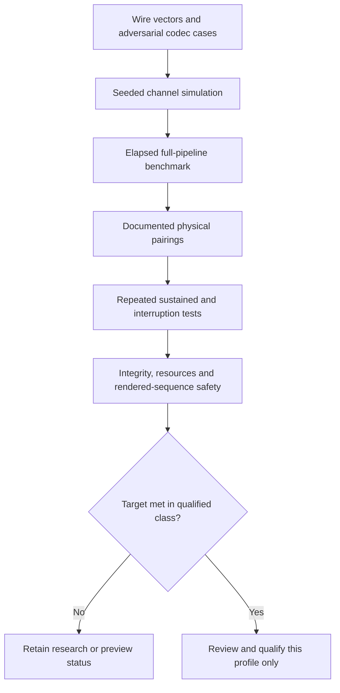
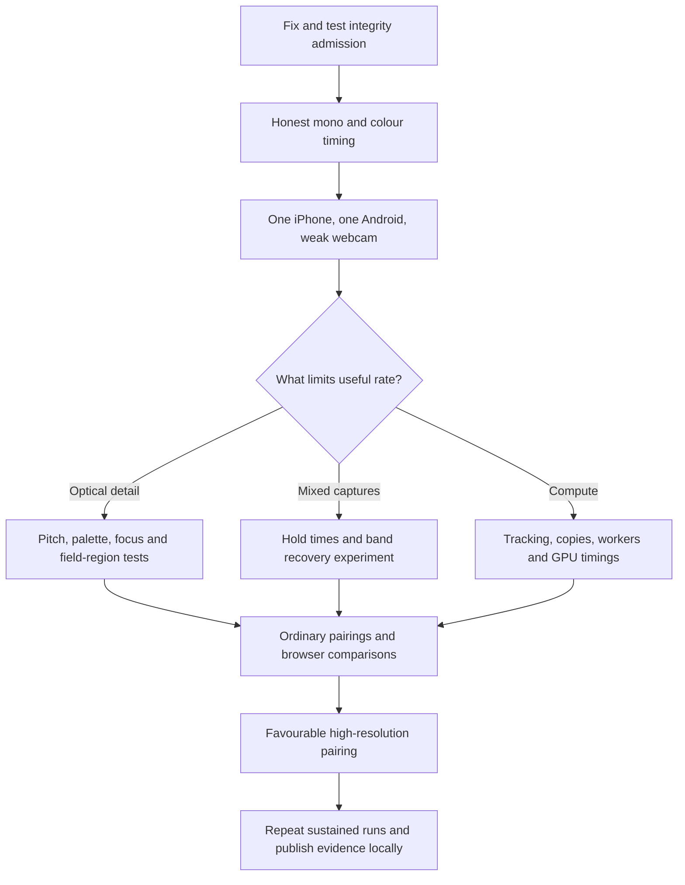
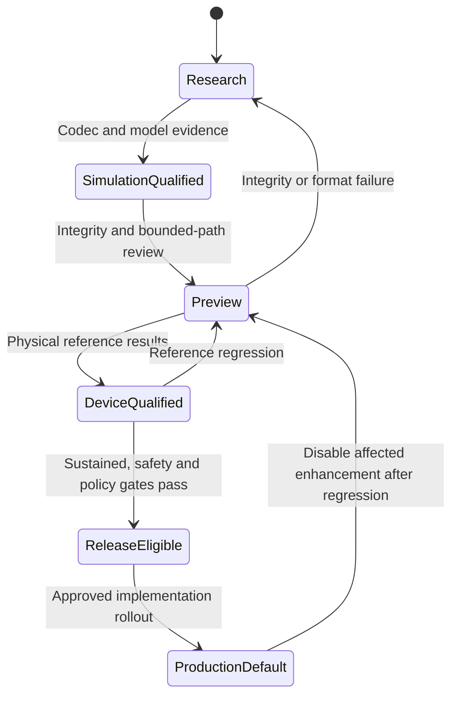
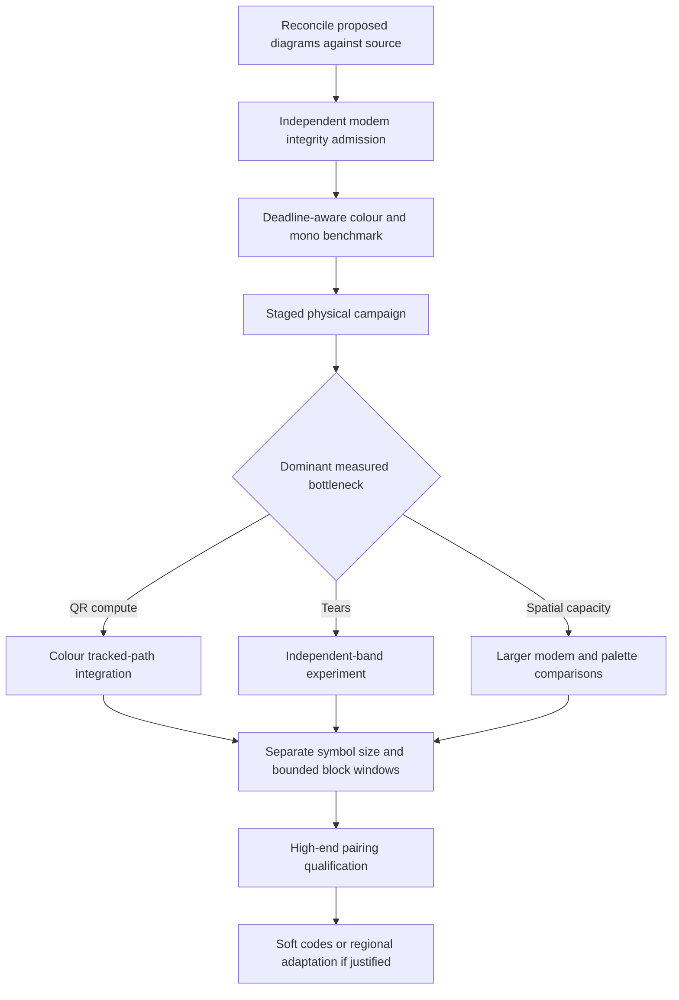

# Optical Transfer validation

**Status: PROPOSED evidence and rollout process.** The current feature gates stay as they are. These pages authorise documentation only; they do not restart paused implementation work.

[Index](README.md) · [Performance](PERFORMANCE.md) · [Protocol](PROTOCOL.md)

## D17: Evidence must cross each boundary

**Status: PROPOSED.**

**Invariant:** relabelling never turns simulation into device evidence. Qualifying one arrangement does not qualify every iPhone, Android phone, webcam or browser.

Check that each diagram renders legibly on GitHub, not only that its Markdown parses. A raster image never replaces a diagram's editable Mermaid source.

## D18: The device campaign grows from what it learns

**Status: PROPOSED.**

**Invariant:** the first phone results do not set a hardware ceiling for the high-end research. Include the weak-camera reference early, keep a favourable high-performance research path, and add configurations when the results justify them.

## Coverage matrix

| Axis        | Coverage to reach as the campaign grows                                                                                |
| ----------- | ---------------------------------------------------------------------------------------------------------------------- |
| Receiver    | Weak webcam, ordinary laptop webcam, older camera, iPhone, Android phone, high-resolution external camera              |
| Browser     | Current supported browsers; several browsers on the same hardware where possible                                       |
| Sender      | Phone OLED, laptop panel, larger LCD; record device pixel ratio and measured pacing                                    |
| Positioning | Stable, handheld, distance, tilt, landscape and portrait, glare                                                        |
| Capture     | Requested, granted and observed resolution and rate; actual combinations, not separate capability maxima               |
| Carrier     | Baseline mono, dense mono, RGB QR, modem; experiments labelled separately                                              |
| Integrity   | Wrong Reed-Solomon accepts, identity corruption, malformed sizes, final hash or authentication failure, mixed sessions |
| Recovery    | Late entry, brief occlusion, lost tracking, duplicates, profile changes, lost feedback                                 |
| Resources   | Worker count, buffers in flight, peak reassembly and output memory, long tasks, heat                                   |
| Files       | Small start-up case, incompressible capacity case, realistic files, existing maximums, proposed windows                |
| Safety      | Real full-size sequences, beacon and profile transitions, pause and cancel, reduced motion                             |

The existing file-size caps limit today's tests. Do not raise them to test a larger transfer before the matching bounds are built and validated. A repeated stream can test sustained capture and compute separately from file-size qualification.

## D19: Feature qualification states

**Status: PROPOSED policy.**

**Invariant:** eligibility is decided per carrier or profile and per capability class. Existing flags and defaults stay until an implementation change passes its own review. Merging documentation never makes an enhancement release-eligible.

Where things stand today: the Prism frame format and LT outer code are the production default; the new outer code, multi-code frames, beacons and the back channel are Preview; the RGB colour layer and the modem are Research. None is DeviceQualified (see the [implementation inventory](ARCHITECTURE.md#implementation-inventory)).

Photosensitivity safety means analysing the actual rendered sequences and transitions at the largest supported size, including saturated red, against the [WCAG flash criteria](https://www.w3.org/WAI/WCAG22/Understanding/three-flashes-or-below-threshold). Warnings, constant average luminance and a pause button are useful controls, not proof of compliance.

Patent notes stay evidence-limited research. Keep the project's exclusions (no RaptorQ, no RFC 5053-exact construction; see [ADR 0037](../adr/0037-prism-outer-code-lt-over-ldpc-precode.md)). Never label a construction patent-clean, approve it from a quick expiry lookup, or infer legal clearance from an open-source licence. Record the family, construction and source reviewed; a new ADR supersedes an earlier decision explicitly.

## D20: Research order by dependency

**Status: PROPOSED order for when implementation work resumes. It replaces the file-transfer part of the order in the pause checkpoint, issue [#1238](https://github.com/fderuiter/QRCraftly-web/issues/1238).**

**Invariant:** this is a dependency map, not a promise to build every branch. Choose the smallest change that addresses the measured bottleneck, and keep both the compatibility goal and the high-end goal.

In issue terms: the modem integrity check (#1163) and an honest colour bench come before the staged phone campaign (#1173). The phone results then choose between the RGB colour layer (#1147) and the modem (#1163 to #1165), and between a manual or fixed profile and duplex.

## Evidence record template

Use this for every device or simulator run that is quoted anywhere.

| Field         | Required detail                                                                                 |
| ------------- | ----------------------------------------------------------------------------------------------- |
| Revision      | Full commit SHA, whether the tree was dirty, and feature flags and switches                     |
| Pairing       | Sender display, receiver camera and lens, operating systems, browsers and versions              |
| Environment   | Distance, angle, light, brightness, positioning and orientation                                 |
| Capture       | Requested, granted and observed settings, and optical sequence yield                            |
| Transfer      | Carrier and profile, outer code, symbol size, inner code, checksums, file sizes and compression |
| Clocks        | Acquisition, the named completion interval, the steady interval and processing stage times      |
| Outcomes      | Verified completion or failure, goodput, wrong accepts, unique data and loss categories         |
| Resources     | Worker, buffer and window limits, peak memory, heat and rate trend, battery if measured         |
| Repetition    | Trial count, every failure, median and range, uncertainty; never hide failed trials             |
| Evidence kind | Measured-device, Measured-sim, Measured-code or Inferred                                        |

Start with three repeats for exploratory comparisons and add more near a release decision or an unstable boundary. Three runs give a median, not a p99. Device results go in the [device checklist](../TRANSFER_DEVICE_CHECKLIST.md) or a results file it links to; the design pages never hold their own tables of measured speeds.

## Sources

[Device checklist](../TRANSFER_DEVICE_CHECKLIST.md), [OPTICAL_RESEARCH.md](../OPTICAL_RESEARCH.md), [ABUSE_PROTECTIONS.md](../ABUSE_PROTECTIONS.md), [ADR 0040](../adr/0040-in-house-first.md), the pause checkpoint [#1238](https://github.com/fderuiter/QRCraftly-web/issues/1238) and Qualcomm's [IETF IPR disclosure 2554](https://datatracker.ietf.org/ipr/2554/).
